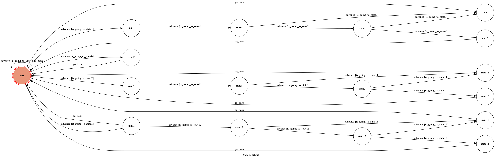

# TOC Project 2017 

chatbot about Game of Thrones

F74036352 雷承勳 

## chatbot

### Programming Language
* Python 3

### Development Environment
* Ubuntu 16.04 LTS

### run code

* before run the code 
  set the`API_TOKEN` and `WEBHOOK_URL` in app.py  to proper values.
```sh
python3 app.py
```

### interact with chatbot

#### 此次實作的chatbot以權力遊戲為主題

#### 一開始的init state：
* 執行完code後，，可輸入"hi",系統將會回應使用者。

* 輸入"族語"、"演員" 或是 "影音"，
  也可以輸入英文的"family language"、"actor" 或是 "video"，
  輸入完後將會進入相對應的state中。
  
#### 輸入"族語"或是"family language"後：
* 會詢問使用者想知道哪個家族的族語，請使用者回答家族的姓氏。

* 使用者問"Stark"，chatbot會回應Stark家的族語，
  並詢問使用者是否想問其他家族的族語，若回答"不了"或是"no"，
  便會回到init state，若想繼續問其他家族的族語，輸入"Lannister"，
  進入下一state，chatbot會回應Lannister家的族語，與之前相同，
  詢問使用者是否想繼續，不想的話，操作方法何之前相同，想的話，
  輸入Targaryen進入下一state，chatbot會回應Targaryen家的族語，
  回應完後會回到init state。
  
#### 輸入"演員"或是"actor"後：
* 會詢問使用者想認識哪個演員，請使用者回答演員在劇中的名字。

* 使用者可以回應演員的名字或是在劇中的稱號，
  回答'Joe Snow' or 'Joe Targaryen'，進入下一state，
  chatbot會傳照片，並問使用者要繼續看其他人嗎？若回答"不了"或是"no"，
  便會回到init state，若想了解其他演員，輸入'Tyrion Lannister' or
  'Tyrion' or 'imp'，進入下一state，同樣chatbot會傳照片，
  並問使用者要繼續看其他人嗎？不想的話作法與之前相同，此時回應'daenerys targaryen'
  or 'mother of dragon'，進入下一state，，chatbot會傳照片，
  之後回到init state。
  
#### 輸入"影音"或是"video"後：
* 詢問使用者想看些什麼精彩的呢？

* 回答'配樂' 或是 'background music'，chatbot會傳對應的音樂，
  並詢問想看更多嗎？若回答"不了"或是"no"，便會回到init state，
  若想繼續，回答'預告'或是'trailer'，chatbot會傳對應的影片，
  並詢問想看更多嗎？不想的話作法與之前相同，若想繼續，回答'片頭曲'
  或是'op'，chatbot會傳對應的音樂後回到init state。
  
## Finite State Machine


